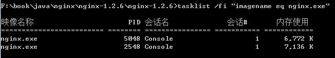

# nginx基本使用
===============

下载安装nginx
配置nginx.conf文件
在 D:\。。。\nginx-1.10.1目录下cmd

查看Nginx的版本号：nginx -v

启动Nginx：start nginx

快速停止或关闭Nginx：nginx -s stop

正常停止或关闭Nginx：nginx -s quit

配置文件修改重装载命令：nginx -s reload

查看windows任务管理器下Nginx的进程命令：tasklist /fi "imagename eq nginx.exe"

> nginx.conf文件配置参考：

    #user  nobody;
    worker_processes  1;

    #error_log  logs/error.log;
    #error_log  logs/error.log  notice;
    #error_log  logs/error.log  info;

    #pid        logs/nginx.pid;

    events {
        worker_connections  1024;
    }

    http {
        include       mime.types;
        default_type  application/octet-stream;

        #log_format  main  '$remote_addr - $remote_user [$time_local] "$request" '
        #                  '$status $body_bytes_sent "$http_referer" '
        #                  '"$http_user_agent" "$http_x_forwarded_for"';

        #access_log  logs/access.log  main;

        sendfile        on;
        #tcp_nopush     on;

        #keepalive_timeout  0;
        keepalive_timeout  65;

        #gzip  on;
      
      #web scada
      server {
            listen       8080;                 # 直接打开 localhost:8080 端口自己定
            server_name  localhost;
        
        location ^~/scada/{
          set             $prerender 'http://192.168.66.345:4567'; # 代理的地址
          proxy_pass      $prerender;
        }
        location / {
                root    "D:/。。。/webscada";                       # 本地项目地址
                index   index.html index.htm; 
            }
      }
    }